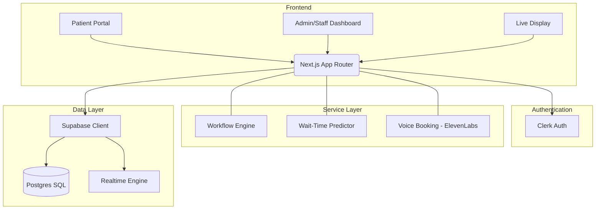

# hacksagon: Smart Hospital Queue Management

hacksagon is a hospital management system designed to reduce waiting-room congestion, automate scheduling, and provide streamlined patient check-ins.

[](https://nextjs.org/)
[](https://supabase.com/)
[](https://clerk.com/)
[](https://elevenlabs.io/)

---

## Key Features

### AI and Automation Layers

- **Voice Appointment Booking**: Patients can schedule appointments via natural conversation using ElevenLabs integration.
- **Predictive Wait Times**: Machine Learning algorithms to predict patient wait times and crowd densities based on historical data.
- **Smart Counter Optimization**: Algorithmic allocation of counters based on current department traffic and patient loads.

### Core Queue Management

- **Live Digital Waiting Room**: Patients can track their live position and estimated time from their mobile devices.
- **Emergency Redirection**: Priority handling for critical cases with automated staff notifications and instant triage routing.
- **Interactive Queue Dashboards**: Real-time status updates for both medical staff and patients in the facility.

### Autonomous Workflow Engine

A node-based automation system that allows hospital administrators to create custom logic for:

- Automated appointment confirmations and rescheduling.
- Department-specific routing rules and triage logic.
- Real-time event triggers and system-wide notifications.

### Integrated Medical Records

- Secure digital profiles for health history tracking.
- Centralized record management accessible by authorized medical personnel.
- Role-Based Access Control (RBAC) ensuring patient data privacy.

---

## Architecture Overview

The system is built on a modern serverless architecture, prioritizing real-time updates and high availability.



---

## Technology Stack

- **Framework**: [Next.js 16 (App Router)](https://nextjs.org/)
- **Language**: [TypeScript](https://www.typescriptlang.org/)
- **Database**: [Supabase (PostgreSQL)](https://supabase.com/)
- **Authentication**: [Clerk](https://clerk.com/)
- **Styling**: [Tailwind CSS v4](https://tailwindcss.com/) & [Framer Motion](https://www.framer.com/motion/)
- **AI Integrations**: [ElevenLabs API](https://elevenlabs.io/)
- **Communication**: [Nodemailer](https://nodemailer.com/)

---

## Getting Started

1. **Clone & Install**:

   ```bash
   git clone <repo-url>
   cd hacksgon
   npm install
   ```
2. **Environment Variables**:
   Create a `.env` file based on our [Setup Guide](docs/SETUP_COMPLETE.md).
3. **Run Dev Server**:

   ```bash
   npm run dev
   ```

---

*Built for better healthcare accessibility.
by team codebreakers*
