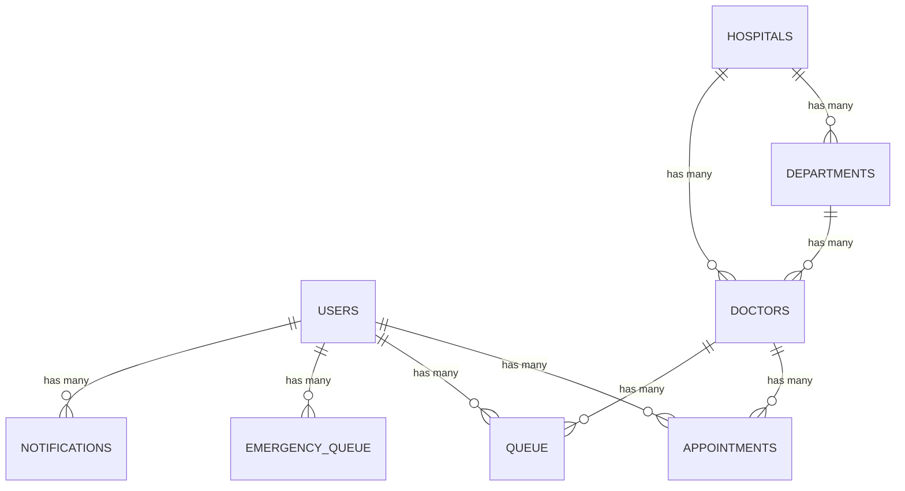

# Hacksagon Database & Security

This document outlines the Supabase (PostgreSQL) schema, its relationships, and the security model governing patient data.

---

## Entity Relationship Diagram (ERD)

The database follows a structured schema designed for performance when querying live queue states.

### Table Definitions:

- **`users`**: Patient profiles, contact details, unique patient_id, and data for biometric checking.
- **`hospitals`**, **`departments`**, **`doctors`**: Facility hierarchy and healthcare resource management.
- **`appointments`**: Traditional scheduled visits and status tracking.
- **`queue`**: Real-time waiting list entries with token tracking and live status updates.
- **`emergency_queue`**: Specialized high-priority queue with severity ratings and rapid processing logic.
- **`historical_data`**: Aggregated counts for crowd prediction and performance analytics.

---

## Row Level Security (RLS)

All tables have RLS enabled to ensure that sensitive medical data is accessed only by authorized users.

| Table            | Policy                               | Role          | Description                                      |
| :--------------- | :----------------------------------- | :------------ | :----------------------------------------------- |
| `users`        | `Users can view own data`          | Authenticated | Can only read/update their own row.              |
| `appointments` | `Users can view own appointments`  | Authenticated | Can only read/create their own schedule.         |
| `queue`        | `Users can view own queue entries` | Authenticated | Can only read their own position status.         |
| `hospitals`    | `Readable by all authenticated`    | Authenticated | Facility info is visible to all valid users.     |
| `doctors`      | `Readable by all authenticated`    | Authenticated | Availability info is visible to all valid users. |

---

## Real-time Sync and Triggers

hacksagon uses database triggers and the Supabase Realtime engine to:

- Automatically manage updated_at timestamps across all primary tables.
- Broadcast changes to the Patient Dashboard when queue positions shift.
- Synchronize staff dashboards with new arrivals without manual refreshes.
- Provide hooks for the Workflow Engine based on database status updates.

---

## Configuration

The database initialization script can be found at `database/supabase-schema.sql`.
To reset or re-seed data, use the `database/runSql.mjs` helper scripts located in the `database/` folder.
